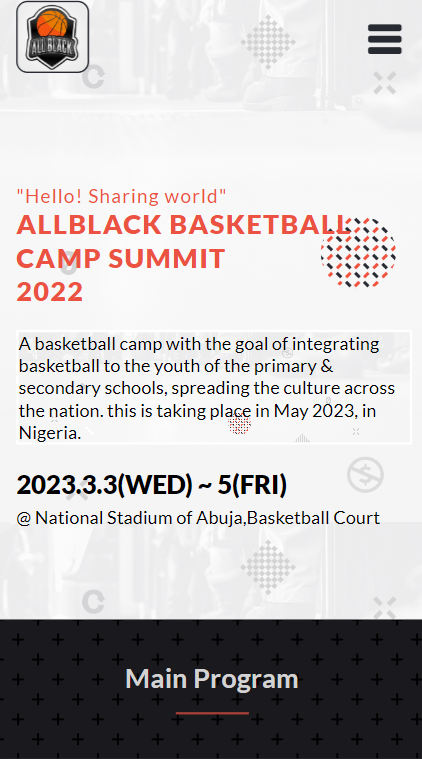
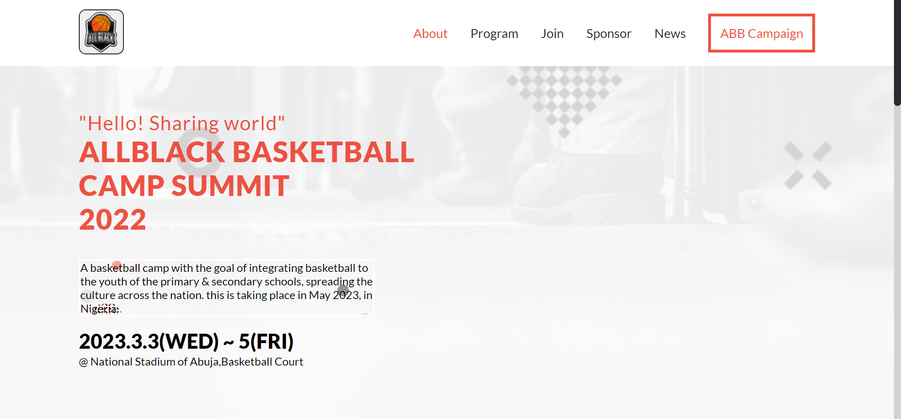

## Allblack-Basketball-Camp-First-Capstone-
  
## Description 
   This Capstone project is a website for a basketbal summer camp where clients can register and have
   full details about the program. The website is fully responsive across devices and
   is built with html, css and javascript..

   - This is the page view:
   
> |     | Mobile version                             | Desktop version                            |     |
> | --- | ------------------------------------------ | -------------------------------------------| --- |
> |     |        | |     |

## <a href="https://usirusenikon.github.io/Allblack-Basketball-Camp-First-Capstone-/">Live Demo</a>

   The objectives of this project is to:

  - Use semantic HTML tags.
  - Apply best practices in HTML code.
  - Use CSS selectors correctly.
  - Use CSS box model.
  - Use Flexbox to place elements in the page.
  - Demonstrate ability to create UIs adaptable to different screen sizes using media queries.
  - Use GitHub Pages to deploy web pages.
  - Apply JavaScript best practices and language style guides in code.
  - Use JavaScript to manipulate DOM elements.
  - Use JavaScript events.
  - Use objects to store and access data.
  - Communicate technical concepts to other technical people.

## Built With
   - HTML, CSS (Flex Box & Grid)
   - JAVASCRIPT
   - VS code
   - Git and Github

## Getting Started
   - To get a local copy up and running follow these simple example steps.

## Prerequisites
   - please install git in your computer.
   - Also install a code editor.
   - A web browser to view the output.

## Setup
   - To clone my repository run this command `git clone https://github.com/UsirusenIkon/Allblack-Basketball-Camp-First-Capstone-.git`  

## Run tests
   For tracking linters errors locally you need to follow these steps:

   - After cloning the project you need to run this command

         npm install This command will download all the dependencies of the project

   - For tracking the linter errors in HTML file run:

         npx hint .

   - For tracking the linter errors in CSS file run:

         npx stylelint "*/.{css,scss}"

## Deployment
   - I used GitHub Pages to deploy my website
   - For more information about publishing sources, see About [github page](https://docs.github.com/en/pages/getting-started-with-github-pages/about-github-pages#publishing-sources-for-github-pages-sites)

## Author
   👤 **Usirusen Ikon**
   - GitHub: [@UsirusenIkon](https://github.com/UsirusenIkon)
   - Twitter: [@Usirusen_Ikon](https://twitter.com/Usirusen_Ikon)
   - LinkedIn: [Usirusen Ikon](https://www.linkedin.com/in/usirusen-ikon-775855174/)

## 🤝 Contributing
   - Contributions, issues, and feature requests are welcome!
   - Feel free to check the [issues](https://github.com/issues) page.

## Show your support
   - Give a ⭐️ if you like this project!

## Acknowledgments
   - Design and inspiration by [Cindy Shin](https://www.behance.net/gallery/29845175/CC-Global-Summit-2015) on Behance.
   - Hat tip to Microvers and all the staff
   - Thanks to My coding Partners
   - Thanks to My Morning-session-group and Standup-team Partners and
   - Thanks to Code Reviewers

## 📝 License
   - This project is [MIT](https://github.com/UsirusenIkon/Portfolio/blob/feature/LICENSE) licensed.
